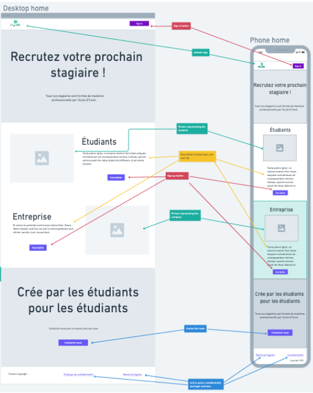

# projet-18-stage-seller-back

# Cachier des charges

# 1 . La présention du projet :
Accompagnement des élèves dans la recherche d'une entreprise pour leur stage de fin de formation. Ce service vise à mettre à disposition un outil aux élèves qui permettrait de mettre en avant son profil auprès des entreprises correspondant qui serait en partenariat avec l'organisme, en leur offrant un soutien personnalisé tout au long du processus de recherche. Notre objectif est de faciliter la mise en relation des entreprises avec des élèves, afin d'optimiser leurs chances de réussite dans leur stage et leur future carrière professionnelle.

# 2. La définitions des besoins :
Afin de permettre aux élèves de présenter un profil professionnel attractif aux entreprises, nous souhaitons collecter les informations suivantes :
- Genre 
- Nom et prénom de l'élève
- Photo de profil
- Compétences techniques
- Indication sur la possibilité de travailler à distance 
- Région idéale pour effectuer le stage
- Courte description écrite par l'élève présentant son profil professionnel et ses aspirations de carrière.
- Informations personnelles telles que le département et la ville 
- CV de l'élève s'il le souhaite ***(optional)***
- Lien vers le profil LinkedIn de l'élève ***(optional)*** 

Ces informations seront rassemblées dans un dossier personnel pour chaque élève et serviront de base pour leur accompagnement dans la recherche de stage et la mise en relation avec les entreprises.

# 3. Les fonctionnalités

## MVP Version 1.0
### a) Eleves :
- Création d'un compte (voir [ 2. La définitions des besoins ])
- Affichage du listing des entreprises participante
- Recherche filtrée par région 

### b) Entreprise : 
- Création d'un compte ( Nom, Prénom, Email, Numéro de téléphone, Intitulé du poste, Entreprise, Région)
- Recherche filtrée des élèves 

## Les évolutions potentielles Version 1.5
- Mise en place d'un systeme de chat entre l'etudiant et l'entreprise pour communiquer 
- Systèmes de matching entre élèves et entreprise
- Système de suggestion automatique

## Les évolutions potentielles  Version 2.0
- Mise en place d'une application mobile
- Ajout d'une section recherche d'emplois

# Technololgies utilisées pour le projet 
- Frontend : Javascript ( React/Nextjs )
- Backend : PHP ( Symfony ) 
- Base de données : Mysql

# 4. La définition de la cible du projet
La cible de ce projet est les étudiants en recherche d'un stage de fin de formation. Le service vise à aider les étudiants à présenter leur profil professionnel de manière attractive aux entreprises et à optimiser leurs chances de réussite dans leur stage et leur future carrière professionnelle. Les entreprises partenaires de l'organisme sont également ciblées pour faciliter la mise en relation avec les étudiants et trouver les profils les plus adaptés à leurs besoins.

# 5. L'arborescence de l'application coté visiteur
```
├── /home 
│    │── /about
│    │── /legal-mentions
│    │── /contact
│    │── /login
│    │── /registration/student
│    │     └── /student 
│    │             │── /profile{name} 
│    │             │      └── /profile/match
│    │             │── /suggests 
│    │ 
│    │
│    │── /registration/company
│          └── /company
│                   │── /profile{name} 
│                   │      └── /profile/match
│                   │── /suggests 
```

# 6. La liste des routes
## Frontend
| URL | Méthode HTTP | Titre | Contenu | Commentaire |
|--|--|--|--|--|
| / | GET | Home | Acceuil | Cette endpoint renvoie la page d'accueil du site. |  
| /about | GET | About | A propos | Cette endpoint renvoie la page "à propos" du site. |
| /contact | GET| Contact | Formulaire de contact | Cette endpoint renvoie le formulaire de contact. |
| /legal-mentions | GET | Legal-mentions | Mentions Légales | Cette endpoint renvoie la page des mentions légales. | 
| /login | POST | login | Formulaire de connexion | Cette endpoint permet à l'utilisateur de se connecter en envoyant ses informations de connexion via la méthode POST. |
| /register | POST | Register | Formulaire d’inscription par role | Cette endpoint permet à un utilisateur de s'inscrire sur le site en envoyant ses informations d'inscription via la méthode POST. Les utilisateurs peuvent s'inscrire en fonction de leur rôle. |
| /profile/{name} | GET | Profile | Profil de l’utilisateur ciblé avec paramètre unique id ou nom | Cette endpoint renvoie le profil d'un utilisateur spécifique en utilisant l'ID ou le nom de l'utilisateur dans l'URL. |
| /{role}/list | GET | All cards | Tous les profils utilisateurs (!roleid) | Cette endpoint permet de récupérer tous les profils d'utilisateurs pour un rôle spécifique en utilisant le nom du rôle dans l'URL. |
| /suggests | GET | Suggests | Les profils filtrés par l'utilisateur uniquement | Cette endpoint permet de récupérer les profils d'utilisateurs filtrés par l'utilisateur connecté. |
| /profile/match | GET | Match | Liste des match avec l'utilisateur  | Cette endpoint permet de récupérer la liste des profils d'utilisateurs qui ont été associés à l'utilisateur connecté. |`

## Backoffice
| URL | Méthode HTTP | Titre | Contenu | Commentaire |
|--|--|--|--|--|
| / | GET | Home | Acceuil | Cette endpoint renvoie la page d'accueil du backoffice. |  
| /skill | GET/POST | Skill | Compétences | Cette endpoint permet de créer et de récupérer des compétences. Utilisez la méthode GET pour récupérer toutes les compétences, et la méthode POST pour créer une nouvelle compétence. |
| /skill/{id} | GET/PUT | Skill | Mise à jour d’une compétence | Cette endpoint permet de récupérer ou de mettre à jour une compétence spécifique, en utilisant l'ID de la compétence dans l'URL. Utilisez la méthode GET pour récupérer la compétence, et la méthode PUT pour mettre à jour la compétence. |
| /skill/{id} | DELETE | Skill | Suppression d’une compétence | Cette endpoint permet de supprimer une compétence spécifique, en utilisant l'ID de la compétence dans l'URL. Utilisez la méthode DELETE pour supprimer la compétence. | 
| /login | GET/POST | login | Formulaire de connexion au backoffice | Cette endpoint permet d'afficher le formulaire de connexion au backoffice, et d'authentifier un utilisateur en utilisant la méthode POST. Utilisez la méthode GET pour afficher le formulaire. |
| /logout | GET | Register | Déconnexion du backoffice | Cette endpoint permet de déconnecter l'utilisateur du backoffice. Utilisez la méthode GET pour déconnecter l'utilisateur. |
| /user | GET/POST | User | Création d’un nouvel utilisateur | Cette endpoint permet de créer un nouvel utilisateur en utilisant la méthode POST, ou de récupérer tous les utilisateurs en utilisant la méthode GET. |
| /user/all | GET | All users | Récupération de l’ensemble des utilisateurs | Cette endpoint permet de récupérer tous les utilisateurs de la base de données. Utilisez la méthode GET pour récupérer les utilisateurs. |
| /user/{id} | GET | User | Récupération d’un utilisateur | Cette endpoint permet de récupérer un utilisateur spécifique en utilisant l'ID de l'utilisateur dans l'URL. Utilisez la méthode GET pour récupérer l'utilisateur. |
| /user/{id} | GET | User | Mise à jour d’un utilisateur | Cette endpoint permet de mettre à jour un utilisateur spécifique en utilisant l'ID de l'utilisateur dans l'URL et en envoyant les données mises à jour en utilisant la méthode PUT. |
| /user/{id} | DELETE | User | Suppression d’un utilisateur | Cette endpoint permet de supprimer un utilisateur spécifique en utilisant l'ID de l'utilisateur dans l'URL. Utilisez la méthode DELETE pour supprimer l'utilisateur. |`

## API
| URL | Méthode HTTP | Titre | Commentaire | Payload |
|--|--|--|--|--|
| /api/user | POST | Créer un nouvel utilisateur | Cette route permet de créer un nouvel utilisateur en envoyant une requête POST contenant les données de l'utilisateur (email, mot de passe et rôle). | email, password, role |  
| /api/user/{role} | GET | Récupérer tous les utilisateurs d'un rôle donné | Cette route permet de récupérer tous les utilisateurs ayant un rôle donné en envoyant une requête GET avec le rôle en paramètre.  | role |
| /api/user/{id} | GET | Récupérer un utilisateur | Cette route permet de récupérer un utilisateur en envoyant une requête GET avec l'ID de l'utilisateur en paramètre. | - |
| /api/user/{id} | PUT/PATCH | Mettre à jour un utilisateur | Cette route permet de mettre à jour un utilisateur en envoyant une requête PUT ou PATCH contenant les propriétés de l'utilisateur à modifier. | propriétés à modifier | 
| /api/user/{id} | DELETE | Supprimer un utilisateur | 	Cette route permet de supprimer un utilisateur en envoyant une requête DELETE avec l'ID de l'utilisateur en paramètre. | - |
| /api/login | POST | Connecter un utilisateur | Cette route permet de connecter un utilisateur en envoyant une requête POST contenant les données de connexion de l'utilisateur (email et mot de passe). | email, password |
| /api/user/{id}/match | GET | Récupérer les matches d'un utilisateur | Cette route permet de récupérer les matches d'un utilisateur en envoyant une requête GET avec l'ID de l'utilisateur en paramètre. | - |
| /api/user/{id}/match | POST | Créer un match | Cette route permet de créer un match en envoyant une requête POST avec l'ID de l'utilisateur qui a liké un autre utilisateur. | recep-Id (id de l'utilisateur liké) |
| /api/user/{id}/match | PUT/PATCH | Modifier un match | Cette route permet de modifier un match en envoyant une requête PUT ou PATCH pour indiquer si l'utilisateur liké a également liké l'utilisateur. | - |
| /api/user/{id}/suggest| GET | Récupérer des suggestions d'utilisateurs | Cette route permet de récupérer des suggestions d'utilisateurs en envoyant une requête GET avec l'ID de l'utilisateur en paramètre pour filtrer les suggestions. | - |`

# 7. La liste des rôles

### Product Owner : Younes
Connaît le produit et représente les intérêts et les besoins du client/des utilisateurs purement fonctionnels (pas techniques)
Tranche en cas de conflits fonctionnels (pas techniques)

### Scrum Master : Younes 
Garant de la méthode du projet : il gère le respect des conventions définies dans le groupe
S'assure que toutes les tâches sont bien attribuées, suivies, accomplies
Assure la communication au sein du groupe : il vérifie que tout le monde a les bonnes informations
Gère l'outil de suivi du projet
Anime la réunion du matin et gère l'avancement du projet

### Lead dev Front : Patrick
Choisit les orientations importantes, choix techniques importants
S'assure du bon fonctionnement de sa partie du projet
### Lead dev Back : Franck
Choisit les orientations importantes, choix techniques importants
S'assure du bon fonctionnement de sa partie du projet

### Git master : Anis
Garant du bon fonctionnement du versionning avec Git.
Responsable du bon fonctionnement du versionning, vérifie les PR et merge, gère les conflits etc.

```bash
git commit -m <type> [<scope>] <short description>
```
#### Lexique des commits
type:
- build: Système de build (example: gulp, webpack, npm)
- docs: Documentation
- feature: Ajout d'une fonctionnalité
- refactor: Changement du code qui ne change rien au - fonctionnement
- style: Changement du style du code ( sans changer la logique)
- test: Ajout et modification des test 
- bug: Résolution d'un bug  

scope:
- formulaire
- authentification
- contact
- etc

# 8. La liste des User stories 
https://trello.com/b/z7YDat2w/apoth%C3%A9ose

# 9. Les documents relatifs à la BDD
##  MCD


## MLD
- User ( code_user, email, password, role, genre, first_name, last_name, is_active, last_connected)
- Student (code_student, img_profile, desrciption, cv, profile_completed, #code_user)
- Company ( code_company, company_name, number_siret, #code_user )
- Address( code_address, address_1, zip_code, city, country, #code_user)
- Skill ( code_skill, type, name )
- SocialMedia ( code_socialmedia, name, url )
- Search ( code_search, search_description, start_date, end_date, #code_company )
- Has ( code_socialmedia, code_student )
- Owns ( code_student, code_skill  )
- Looks ( code_search , code_skill )
- Match (code_student, code_company, match , code_target, notification_push)

# 10. Les Wireframes


